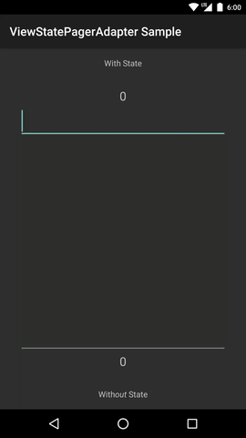

ViewStatePagerAdapter
=====================

Saves and restores View states in ViewPagers.

[`ViewStatePagerAdapter`](viewstatepageradapter/src/main/java/com/nightlynexus/viewstatepageradapter/ViewStatePagerAdapter.java) is simply an implementation of `android.support.v4.view.PagerAdapter` and automatically saves and restores View states when returning to pages (previously removed Views in the ViewPager) and after ViewPager's state restoration.
`ViewStatePagerAdapter` is similar to `android.support.v4.app.FragmentStatePagerAdapter` but for use with just Views, rather than Fragments.

### Sample

The sample application shows the difference between the use of a `ViewStatePagerAdapter` and a `ViewPagerAdapter` (with no saving and restoring of View state).



Download
--------

Gradle:

```groovy
compile 'com.nightlynexus.viewstatepageradapter:viewstatepageradapter:1.0.1'
```

License
--------

    Copyright 2016 Eric Cochran

    Licensed under the Apache License, Version 2.0 (the "License");
    you may not use this file except in compliance with the License.
    You may obtain a copy of the License at

       http://www.apache.org/licenses/LICENSE-2.0

    Unless required by applicable law or agreed to in writing, software
    distributed under the License is distributed on an "AS IS" BASIS,
    WITHOUT WARRANTIES OR CONDITIONS OF ANY KIND, either express or implied.
    See the License for the specific language governing permissions and
    limitations under the License.
